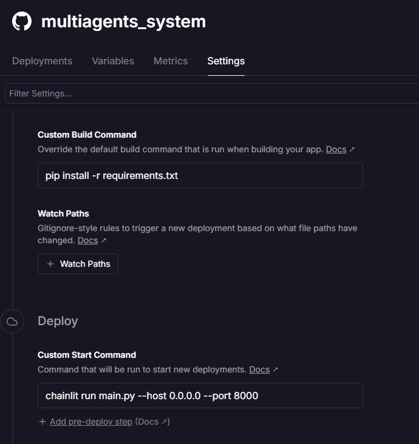
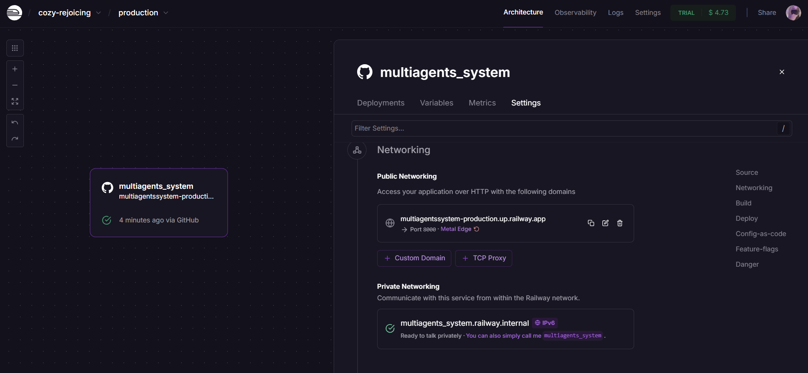
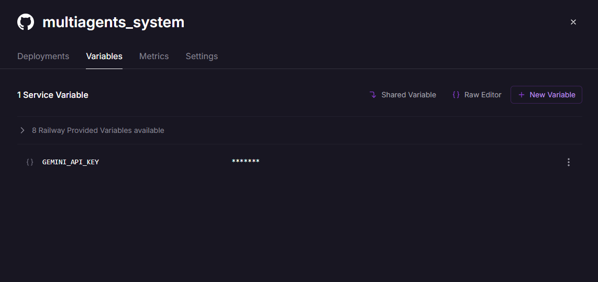

# 🧠 Multiagents System – Chainlit x OpenAI Deployment

This is a simple agent built using the OpenAI Agent SDK, Gemini API and Chainlit. The project is deployed on **Railway** for public access and testing.

---

## ⚙️ Project Setup

```bash
uv init .
uv add openai-agents python-dotenv
.venv\Scripts\activate
```

# Deployment on Railway

We used Railway to deploy the project with GitHub integration.
Below are the screenshots showing important deployment configurations:


## 📸 Deployment Screenshots

### 🛠️ Railway Settings for Deployment
Shows the custom build and start commands used to deploy the project.



---

### 🌐 Public URL & Networking
Displays the public Railway URL and networking configuration.



---

### 🔐 Environment Variables
Shows the added environment variable (`GEMINI_API_KEY`) for secure API integration.


